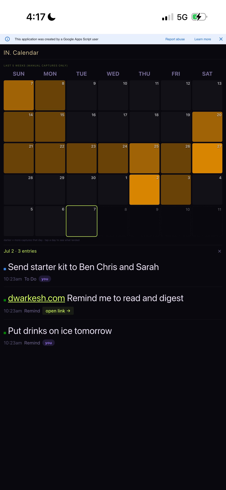
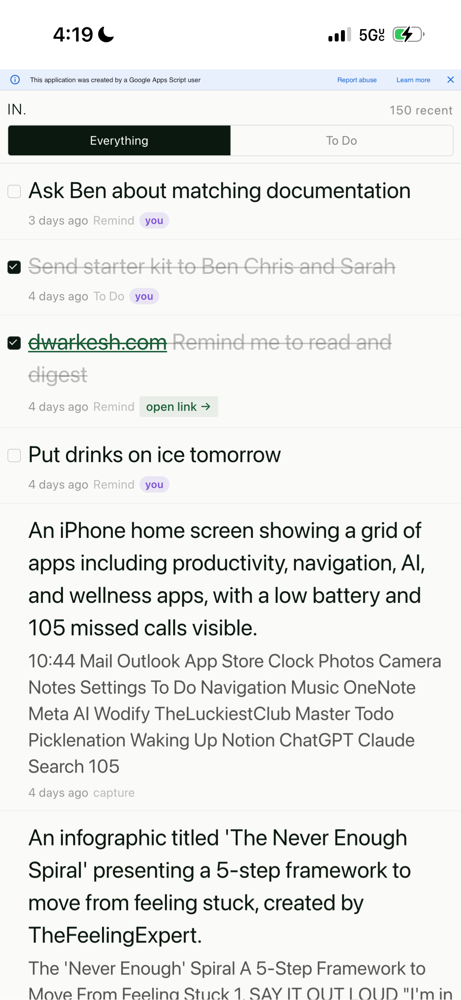
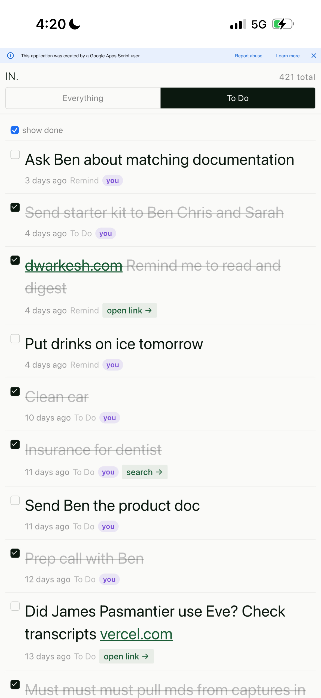
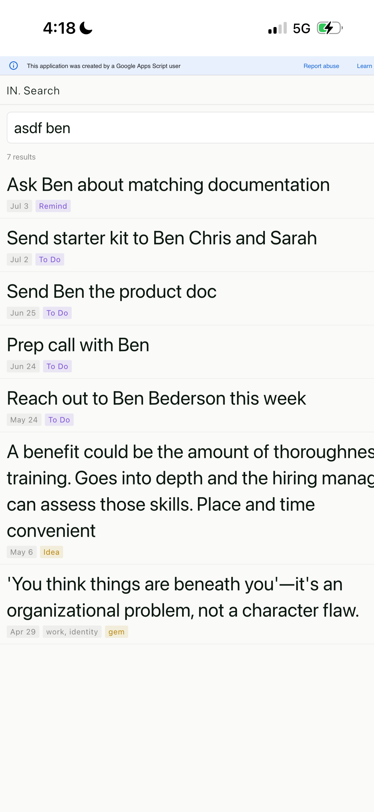

# OUT Is a Sandbox, Not a Destination

**Status:** July 2026. Response to a recurring pitch conversation: people hear "OUT can be anything, we'll figure it out later" and read it as a gap, not a feature.
**Companion docs:** `01_vision.md` (query model, §1), `05_now.md`

---

## The Question People Actually Ask

When I describe iN, people ask what it outputs. A dashboard? A digest? A calendar? I tell them OUT can be almost anything, that the specific instantiation is close to free once the capture layer exists, and we'll design the first ones together. Most people hear that as "we haven't figured out the product yet." They wait for the real answer.

That reaction assumes the value sits in the OUT: the dashboard, the view, the specific thing on the screen. It doesn't. The value is in IN: the discipline of intentional capture, accumulated over time, in one place, in a form that isn't locked to any single presentation of it.

## The Argument

iN's query model has two inputs. A data bundle: the personal model, built slowly, hard to fake, expensive to accumulate. And an intention: the ask in the moment, cheap to state, cheap to change. OUT is the intention layer. Swapping one OUT for another doesn't touch the bundle underneath it. It's one prompt away.

That asymmetry is the actual product. A system where the expensive thing (your captured signal) and the cheap thing (this week's view of it) are cleanly separated is a system you can keep reshaping without rebuilding. A system where the two are fused, where the dashboard *is* the product, is a system you're stuck with the day you ship it.

So when I say OUT can be anything, I mean it as a structural claim, not a hand wave. The four views below are proof of that claim, not a roadmap of what OUT is limited to.

## Proof, Not Assertion

Four screenshots below, one Google Sheet of 450+ captures behind all of them, four different OUTs, none planned as a set. Each exists because a specific question came up and got answered by writing a new view against the same underlying data, not by re-architecting anything under it.

**Calendar**: a 5-week grid, one cell per day, darker cells mean more captures that day, tap a day to see what landed. Built because Pulse's hour-of-day chart was interesting once and then static; a real calendar of dates stays useful week over week.

**Landed, Everything**: the raw feed, newest first, every capture regardless of type.

**Landed, To Do**: the same feed filtered to actionable items, with a "show done" toggle so closed loops don't disappear, they just gray out.

**Search**: free-text query across the whole capture history, gated by an inline prefix so it isn't just sitting open on a home screen.

Same rows. Four completely different questions answered. None of them existed as a plan on day one. Calendar didn't exist until Pulse's limits showed up in use. Search didn't exist until "what did I say about Ben again" became a real recurring need. That's the pattern: OUT gets built in response to an actual question, cheaply, against data that was already there.

## Why This Matters for the Pitch

The instinct to ask "but what does it output" is reasonable. Most software is sold by its output. iN inverts that: the output is the least durable, least defended part of the system, and that's the point. The moat is the capture discipline and the accumulated personal model. The views are disposable by design, which is also why they're numerous, cheap, and specific to the person who asked for them, instead of one generic dashboard everyone gets the same version of.

## Note on the Other OUT

`01_vision.md` already tracks an open item called "OUT design session" (§14, and the iNsight at line 125). That one is about a different question entirely: why people don't return to a system, and how to design the *exit* experience so abandonment isn't silent. Same word, unrelated argument. Worth keeping distinct so the two don't get flattened into each other in a future pass.

---

*July 2026. Amy K. Karlson / Smith-Karlson LLC.*
